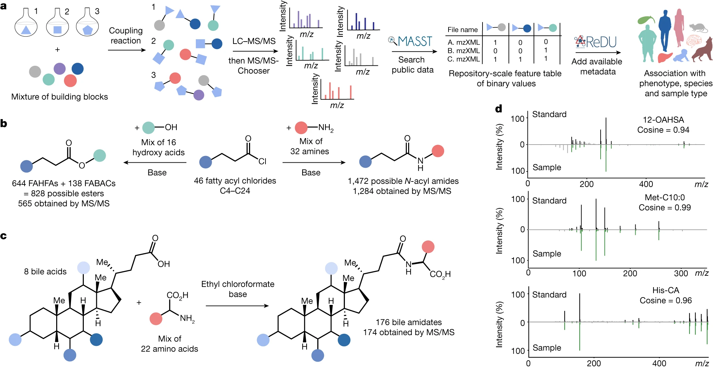

# Reverse metabolomics

All the required codes are included in this GitHub repository, such that further updates can be easily tracked.

The entire SOP for reverse metabolomics is [available here](https://docs.google.com/document/d/1jvLTQ_gbU6-ljOjG2v-6W_8KIpOSBRT5cJthqHA_TB0/edit?usp=sharing) (may need updated).

### generate_smiles
This is used to generate SMILES data using reactants.

### generate_library
This is to generate the library for reverse metabolomics in batch, using mzML files and csv files (compound files generated as above).

- Input:
  - **mzML** files
  - **csv** files (compound list)

- Output:
  - one library **tsv** file
  - `metadata` folder
    - entire metadata table for each mzML
    - EIC plots for each compound in each mzML
    - MS2 spectra (selected & unselected) for each mzML

See details in the [README](generate_library).  

----------------
### filter_library (deprecated)
This is used to filter the library generated by MZmine3 workflow.

